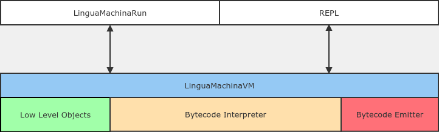
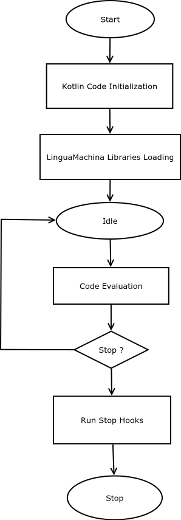

# VM Architecture

## VM interface

The VM provides an API to evaluate code strings and load libraries.

## VM Startup Process

Startup process:

### Kotlin Code Initialization

Some code provides the primitives the Lingua Machina is built on.
Such primitives include: object representation, primitive methods and I/O.

### Lingua Machina Libraries Loading

These libraries are the ones written in the Lingua Machina language. These libraries can define new types or
extend already existing ones.

### Run Stop Hooks

In order to free acquired resources during startup or org.linguamachina.klinguamachina.interpreter, stop hooks can be registered and will be executed
when the VM is shutting down.
